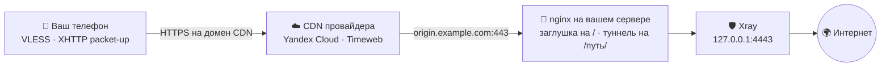

<div align="center">

# CDN-Installer

**VPN, который снаружи выглядит как обычный сайт.**

Одна команда в консоли сервера — дальше мастер спросит и всё поставит сам.

</div>

---

## Что это

Скрипт поднимает на вашем сервере VPN (VLESS на движке Xray) и прячет его за
российский CDN — ту самую сеть, через которую грузятся видео ВКонтакте и плитки
Яндекс.Карт.

Ваш телефон открывает HTTPS к адресу вроде `cdn12.gslb.vkcdn.ru` — ровно к
такому же, как когда вы листаете ленту ВК. Провайдер видит обычный CDN.
Заблокировать эти адреса нельзя: на них висят банки, госуслуги и стриминги.

| Слово | Простыми словами |
|---|---|
| **Нода** | сам VPN — то, что гоняет ваш трафик |
| **Панель** | админка: пользователи, статистика, управление нодами |
| **Origin** | ваш сервер, откуда CDN берёт данные — `origin.вашдомен` |
| **XHTTP packet-up** | режим Xray, где трафик нарезан на обычные HTTP-запросы: иначе через CDN он не пролезет |

---

## Установка

Понадобится: VPS с **Ubuntu 22.04/24.04 или Debian** под `root` (для Remnawave —
от 5 ГБ диска), домен с доступом к DNS и аккаунт у CDN-провайдера.

**1. Две A-записи на IP сервера, без проксирования** (в Cloudflare — серое облачко):

```
A     origin.example.com  →  <IP сервера>    для CDN
A     example.com         →  <IP сервера>    для панели и её сертификата
```

Домен панели направлять на CDN нельзя — Let's Encrypt проверяет его прямо на
сервере. Технический домен от провайдера в свой DNS заводить не нужно: клиенты
могут ходить прямо на него. Если хотите показывать клиентам свой домен —
направьте его на технический **CNAME**-записью, скрипт спросит его в конце и
покажет готовую строку.

**2. Одна команда:**

```bash
curl -fsSL https://raw.githubusercontent.com/CraftStick/node-installer-cdn/main/node-installer-cdn.py -o node-installer-cdn.py && sudo python3 node-installer-cdn.py
```

**3. Ответы на вопросы** — режим, CDN, домен, запасной вход. Все
спрашиваются в начале, дальше скрипт минут десять работает сам.

**4. Создание CDN-ресурса** — единственный ручной шаг: у провайдеров нет для
этого API. Скрипт напечатает инструкцию под вашего провайдера, с точными
галочками и IP вашего origin. Сделали — вернулись в консоль и ввели выданный
технический домен, а следом, если нужен, свой домен для клиентов.

В конце появится блок DNS-записей (A на origin и CNAME своего домена) и
карточка с итогами: адрес панели, логин с паролем, ссылка на подписку и готовая
`vless://`-ссылка.

> [!IMPORTANT]
> Скрипт меняет сеть и системные службы. Обкатывайте на одноразовом VPS,
> лучше со снапшотом, сделанным до старта.

Оборвалось — просто запустите заново, скрипт продолжит с того же места. Начать
с нуля: `--fresh`. Без вопросов: `--mode 1 --cdn yandex --domain example.com`.

---

## Как это устроено



CDN ничего не кеширует, а сразу передаёт запросы на ваш origin. Кто зайдёт на
`origin.example.com` браузером — увидит обычную заглушку; угадает путь туннеля —
получит `404`.

---

## CDN-провайдеры

| `--cdn` | Провайдер | Связь с origin | Скорость | Регистрация |
|:-:|---|---|---|:-:|
| `yandex` | Yandex Cloud | HTTPS на `origin.вашдомен` | 100+ Мбит/с | открытая |
| `timeweb` | Timeweb | HTTP на IP сервера, порт 80 | 50–80 Мбит/с | открытая |

У обоих есть бесплатный тариф. Проще начать с **Yandex Cloud**: до origin он
ходит по HTTPS, то есть участок CDN → сервер шифруется. У **Timeweb** источник
задаётся IP-адресом и HTTPS до origin выключается, зато ресурс создаётся в пару
кликов; бывают провалы скорости.

Провайдер выдаёт технический домен (`*.cdn.twcstorage.ru` у Timeweb,
`*.edgecdn.ru` у Yandex). Можно отдать клиентам его, а можно свой домен —
тогда он направляется на технический CNAME-записью, и на него нужен сертификат
у провайдера CDN.

Провайдера можно указать номером (`1` = Yandex, `2` = Timeweb), но имя надёжнее:
номера сдвинулись после удаления VK Cloud и Beeline.

---

## Три сценария

| № | Что ставим | Когда выбирать |
|:-:|---|---|
| **1** | Панель + нода + CDN на одной машине | первый запуск, один сервер |
| **2** | Нода + CDN здесь, регистрация в готовой панели | добавить новую локацию |
| **3** | Только CDN перед работающей нодой | нода есть, не хватает маскировки |

### Поддерживаемые панели

| Панель | Развёртывание | Что настраивает скрипт |
|---|---|---|
| **Remnawave 3.x** | Docker Compose | backend с базой, ноду, домены, сертификаты, профиль с CDN-инбаундом, хост, сквад, пользователя и подписку |

Другая панель не поддерживается: 3x-ui убран.

**Режим 2** добавляет CDN-инбаунд и веб-обвязку к уже работающей панели —
переустанавливать её не нужно. Скрипт создаёт профиль с инбаундами, регистрирует
эту машину как ноду, заводит хост и пользователя, а свои инбаунды **дописывает**
в `Default-Squad`, не трогая чужие. Панели он касается только через API: нужен
SSH к её серверу (API-вызовы идут `curl`'ом изнутри) и, если токен не передан
флагом, скрипт выпишет его сам, записав строку в таблицу `api_tokens`.

> Раньше режим 2 ставил ноду на другой сервер по SSH — он убран, а режимы
> сдвинулись: прежний 3 стал **2**, прежний 4 стал **3**. Чтобы добавить
> вторую машину, запустите на ней режим 2 и укажите адрес уже готовой панели.

---

## Что скрипт берёт на себя

Docker, панель с базой, Xray, nginx, сертификаты Let's Encrypt, профиль CDN и
хост в панели, подписки, страницу-заглушку. Плюс система: ufw с политикой
«всё запрещено» (открыты только SSH, 80, 443 и порты включённых входов), BBR,
swap, лимиты на файлы. Панель и база слушают только `127.0.0.1`, файлы с
секретами — права `600`, порт ноды 2222 пускает только IP панели.

Основной вход — **XHTTP packet-up** через CDN, ставится всегда. Путь туннеля
генерируется случайным (например `/content/media/k3f9xa2b`): голый путь отдаёт
`404`, проксируется только то, что под ним. К основному входу предлагается
запасной **gRPC Reality** — прямой, на случай отказа CDN, TCP `2053`.

---

## Флаги

<details>
<summary><b>Показать полный список</b></summary>

```
--mode            1..3 — сценарий (см. таблицу выше)
--cdn             yandex | timeweb   (или номером: 1 = Yandex, 2 = Timeweb)
--domain          домен без http://
--front           nginx (по умолчанию) или caddy — чем поднимать фронт.
                  Caddy сам выпускает и продлевает сертификаты. Только флагом,
                  в мастере такого вопроса нет

# режим 2 — к существующей панели
--panel-url       IP/URL панели
--panel-ssh-user  SSH-пользователь панели (по умолчанию root)
--panel-ssh-pass  SSH-пароль панели
--panel-key       путь к приватному SSH-ключу панели (прежнее имя --node-key
                  тоже принимается)
--panel-token     API-токен Remnawave. Не задан — скрипт возьмёт
                  /opt/remnawave/.panel_token с самой панели (есть, только если
                  панель ставил этот же установщик), иначе войдёт по
                  --panel-user / --panel-pass
--panel-user      логин админа панели
--panel-pass      пароль админа панели

# режим 3 — только CDN
--xport           порт, который уже слушает Xray на 127.0.0.1 (обычно 4443)
--path            существующий путь туннеля (например /abc123)

# повторная установка
--wipe            снести прошлую установку без вопросов (для автозапуска)
--no-wipe         не трогать прошлую установку, ставить поверх
--fresh           забыть сохранённый прогресс и начать с нуля

# домены CDN (иначе скрипт спросит их в конце)
--cdn-domain      технический домен ресурса CDN
--client-domain   свой домен для клиентов, CNAME на технический

# прочее
--no-grpc         не добавлять запасной gRPC Reality
--no-origin-le    не выпускать Let's Encrypt для origin
--skip-dns-wait   не ждать, пока применится DNS
--skip-cdn-wait   не ждать настройки CDN у провайдера
```

</details>

---

## Если что-то пошло не так

| Симптом | Что смотреть |
|---|---|
| Не выпускается сертификат | домен должен вести прямо на сервер, **без** проксирования Cloudflare |
| Соединение не поднимается | в CDN-ресурсе должны быть выключены кеширование и сжатие, а параметры запроса — **не** игнорироваться: `sessionID` и `seq` едут именно в них |
| CDN отвечает, VPN молчит | откройте `https://origin.вашдомен`: заглушка есть — фронт жив, дело в настройках CDN-ресурса |
| Начать с нуля | `sudo python3 node-installer-cdn.py --fresh --wipe` |

В конце установки скрипт сам проверяет порты, фронт, сертификат и `404` на пути
туннеля. Что не сошлось — помечает значком ▲.

---

## Из чего собрано

Remnawave `backend:3` · Xray-core `26.7.28` · PostgreSQL `18.4` · Valkey
`9-alpine`. Поверх: Docker с compose, nginx (или Caddy), certbot, ufw/iptables.
С сервером панели (режим 2) скрипт общается по SSH.

Весь установщик — один файл `node-installer-cdn.py`. Тесты гоняются без сервера
и без root: `python3 -m unittest discover -v`.

---

> [!WARNING]
> **Дисклеймер.** Скрипт работает под `root`: ставит Docker, скачивает и
> запускает сторонние скрипты (`get.docker.com`, `Xray-install`),
> правит `iptables`/`ufw`, выпускает сертификаты. Запускайте только на своих
> серверах. Ответственность — на том, кто запускает.

## Лицензия

[MIT](LICENSE) — копируйте, меняйте, встраивайте куда угодно, в том числе в
коммерческие проекты. Условие одно: сохранить текст лицензии и указание
авторства.


<div align="center">

---

Если было полезно — поставь ⭐, это очень помогает!

If you found this useful, consider leaving a ⭐ — it helps a lot!

</div>
