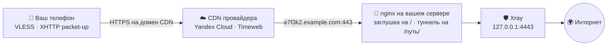

<div align="center">

# CDN-Installer

**VPN, который снаружи выглядит как обычный сайт.**

Одна команда в консоли сервера — дальше мастер спросит и всё поставит сам.

</div>

---

## Что это

Скрипт поднимает на вашем сервере VPN (VLESS на движке Xray) и прячет его за
российский CDN — ту самую сеть, через которую грузятся видео ВКонтакте и плитки
Яндекс.Карт.

Ваш телефон открывает HTTPS к адресу вроде `cdn12.gslb.vkcdn.ru` — ровно к
такому же, как когда вы листаете ленту ВК. Провайдер видит обычный CDN.
Заблокировать эти адреса нельзя: на них висят банки, госуслуги и стриминги.

| Слово | Простыми словами |
|---|---|
| **Нода** | сам VPN — то, что гоняет ваш трафик |
| **Панель** | админка: пользователи, статистика, управление нодами |
| **Origin** | ваш сервер, откуда CDN берёт данные — случайный поддомен вида `a7f3k2.вашдомен` |
| **XHTTP packet-up** | режим Xray, где трафик нарезан на обычные HTTP-запросы: иначе через CDN он не пролезет |

---

## Установка

Понадобится: VPS с **Ubuntu 22.04/24.04 или Debian** под `root` (для Remnawave —
от 5 ГБ диска), домен с доступом к DNS и аккаунт у CDN-провайдера.

**1. Две A-записи на IP сервера, без проксирования** (в Cloudflare — серое облачко):

```
A     a7f3k2.example.com  →  <IP сервера>    источник для CDN
A     example.com         →  <IP сервера>    для панели и её сертификата
```

Поддомен источника скрипт придумывает сам, случайный: имя вроде
`origin.example.com` стоит первым в словарях для поиска настоящего IP за CDN.
Точное имя он покажет на шаге DNS — его и заводите. Своё можно задать флагом
`--origin-domain`.

> Случайное имя прячет источник только от перебора. Сертификат Let's Encrypt
> для него публикуется в CT-логах, и имя становится видно через поиск по ним
> (crt.sh). Кому это важно — ставьте с `--no-origin-le`: источник останется на
> самоподписанном сертификате, а у CDN-провайдера нужно выключить проверку
> сертификата источника.

Домен панели направлять на CDN нельзя — Let's Encrypt проверяет его прямо на
сервере. Технический домен от провайдера в свой DNS заводить не нужно: клиенты
могут ходить прямо на него. Если хотите показывать клиентам свой домен —
направьте его на технический **CNAME**-записью, скрипт спросит его в конце и
покажет готовую строку.

**2. Одна команда:**

```bash
curl -fsSL https://raw.githubusercontent.com/CraftStick/node-installer-cdn/main/node-installer-cdn.py -o node-installer-cdn.py && sudo python3 node-installer-cdn.py
```

**3. Ответы на вопросы** — режим, CDN, домен, запасной вход. Все
спрашиваются в начале, дальше скрипт минут десять работает сам.

**4. Создание CDN-ресурса** — единственный ручной шаг: у провайдеров нет для
этого API. Скрипт напечатает инструкцию под вашего провайдера, с точными
галочками и IP вашего origin. Сделали — вернулись в консоль и ввели выданный
технический домен, а следом, если нужен, свой домен для клиентов.

В конце появится блок DNS-записей (A на origin и CNAME своего домена) и
карточка с итогами: адрес панели, логин с паролем, ссылка на подписку и готовая
`vless://`-ссылка.

> [!IMPORTANT]
> **Ставьте на чистый сервер.** Скрипт меняет сеть и системные службы: правит
> nginx, поднимает Docker, включает ufw с политикой «запрещено всё, кроме
> разрешённого». На сервере, где уже что-то живёт, он это что-то заденет.
> Лучше всего — свежий VPS или снапшот, сделанный до старта.

Перед установкой скрипт находит остатки прошлой попытки и предлагает их снести:
каталоги `/opt/remnawave` и `/opt/remnanode`, контейнеры и тома Remnawave, свои
конфиги nginx и Caddy, docker-сети и правила ufw на порт ноды. Чужого он не
трогает — только то, что писал сам (свои конфиги он помечает строкой
`# node-installer-cdn` в первой строке).

Что **остаётся** и после сноса — и что при переустановке придётся убрать самому,
если оно мешает:

| Остаётся | Зачем/почему |
|---|---|
| Docker и его образы | нужны следующей установке, качать заново долго |
| Сертификаты в `/etc/letsencrypt` | переиспользуются; у Let's Encrypt лимит 5 выпусков в неделю на домен |
| `/etc/sysctl.d/99-vpn-tuning.conf`, лимиты файлов | системный тюнинг, не мешает |
| Остальные правила ufw и открытые порты | там могут быть ваши, не наши |
| Ресурс CDN у провайдера | создаётся руками, руками и удаляется |

Оборвалось — просто запустите заново, скрипт продолжит с того же места. Начать
с нуля: `--fresh`. Поставить поверх, ничего не снося: `--no-wipe`. Без вопросов:
`--mode 1 --cdn yandex --domain example.com`.

---

## Как это устроено



CDN ничего не кеширует, а сразу передаёт запросы на ваш origin. Кто зайдёт на
источник браузером — увидит обычную заглушку; угадает путь туннеля — получит
`404`.

---

## CDN-провайдеры

| Провайдер | Связь с origin | Скорость | Регистрация |
|:-:|---|---|:-:|
| Yandex Cloud | HTTPS на домен источника | 100+ Мбит/с | открытая |
| Timeweb | HTTP на IP сервера, порт 80 | 50–80 Мбит/с | открытая |

У обоих есть бесплатный тариф. Проще начать с **Yandex Cloud**: до origin он
ходит по HTTPS, то есть участок CDN → сервер шифруется. У **Timeweb** источник
задаётся IP-адресом и HTTPS до origin выключается, зато ресурс создаётся в пару
кликов; бывают провалы скорости.

Провайдер выдаёт технический домен (`*.cdn.twcstorage.ru` у Timeweb,
`*.topology.gslb.yccdn.ru` у Yandex). Можно отдать клиентам его, а можно свой домен —
тогда он направляется на технический CNAME-записью, и на него нужен сертификат
у провайдера CDN.

---

## Yandex Cloud CDN — пошагово

Раздел собран по живой установке: здесь только то, что реально понадобилось, и
места, где легко ошибиться.

Главное, что нужно понять заранее — доменов **два**, и они разные:

| Домен | Кто им пользуется | Пример |
|---|---|---|
| **origin** | CDN ходит по нему за данными на ваш сервер | `a7f3k2.example.com` |
| **клиентский** | его видят клиенты, он же домен CDN-ресурса | `cdn.example.com` |

Технический домен Yandex (`…topology.gslb.yccdn.ru`) отдавать клиентам нельзя:
вашего сертификата на нём нет.

### 1. Сертификат

**Certificate Manager → создать сертификат от Let's Encrypt.**

- Домены: клиентский домен
- Тип проверки: DNS

Yandex покажет запись для проверки. Заведите у своего DNS-провайдера **ровно
ту**, что показана в консоли: тип и значение берите оттуда, не по памяти.
Дождитесь статуса **Issued**.

> Эту запись нельзя удалять после выпуска — Yandex продлевает сертификат
> автоматически и каждый раз проверяет домен по ней. Удалите — через 90 дней
> клиенты получат ошибку TLS.

### 2. Группа источников

**Cloud CDN → Группы источников → создать.**

- Источник: ваш origin
- Приоритет: основной

Отдельный шаг, потому что это главная ловушка. Если создавать ресурс через
«Копирование конфигурации» с другого ресурса, сюда подтянется **чужая группа**.
Поменять SNI и Host при этом недостаточно: CDN всё равно пойдёт за данными на
старый адрес и вернёт `502`.

### 3. Ресурс

**Cloud CDN → Создать ресурс.**

| Поле | Значение |
|---|---|
| Доменное имя ресурса | клиентский домен |
| Источник | группа из шага 2 |
| Протокол для источников | HTTPS |
| Имя SNI-хоста | origin |
| Заголовок Host | своё значение → origin |
| Сертификат | из шага 1 |
| Переадресация клиентов | с HTTP на HTTPS |

Названия полей похожи: **«Доменное имя источника»** — это ваш сервер, а
**«Доменное имя»** ниже — то, что увидят клиенты. Перепутать их легко, а
результат — петля: CDN идёт сам к себе.

На следующих шагах мастера:

- **Кеширование** — выключить и CDN, и браузерное; снять «сегментацию больших
  файлов»; сжатие выключить
- **HTTP-заголовки и методы** — «игнорировать параметры запроса» не включать,
  в них едет обвязка сессии
- **Дополнительно** — выгрузка логов и экранирование источников не нужны

Про методы: в списке разрешённых у Yandex есть только **GET, HEAD, OPTIONS**,
POST отсутствует. Это не проблема — установщик настраивает туннель на аплинк
GET-запросами (`uplinkHTTPMethod`), иначе через этот CDN он бы и не работал.

### 4. DNS

На странице ресурса, блок **«Настройки DNS»**, Yandex показывает значение вида
`c5d6df029464d4c0.topology.gslb.yccdn.ru`. Оно общее для аккаунта, запросы
разводятся по домену.

```
A      a7f3k2.example.com  →  <IP сервера>                          (источник)
CNAME  cdn.example.com     →  xxxxxxxx.topology.gslb.yccdn.ru       (клиентам)
```

Обе записи — без проксирования (в Cloudflare серое облачко).

### 5. Ответы установщику

- **CDN домен** — техническое значение `…yccdn.ru`
- **Свой домен для клиентов** — ваш клиентский домен

### 6. Проверка

```bash
curl -s -o /dev/null -w '%{http_code}\n' https://cdn.example.com/
```

`200` — заглушка вашего nginx пришла через CDN, цепочка собрана.

Что видно в логе сервера, когда клиент подключается:

```bash
awk '/<путь туннеля>/ {print $6, $9, $10}' /var/log/nginx/access.log | tail
```

Нужны `GET … 200` с ненулевым размером ответа.

---

## Три сценария

| № | Что ставим | Когда выбирать |
|:-:|---|---|
| **1** | Панель + нода + CDN на одной машине | первый запуск, один сервер |
| **2** | Нода + CDN здесь, регистрация в готовой панели | добавить новую локацию |
| **3** | Только CDN перед работающей нодой | нода есть, не хватает маскировки |

### Поддерживаемые панели

| Панель | Развёртывание | Что настраивает скрипт |
|---|---|---|
| **Remnawave 3.x** | Docker Compose | backend с базой, ноду, домены, сертификаты, профиль с CDN-инбаундом, хост, сквад, пользователя и подписку |

**Режим 2** добавляет CDN-инбаунд и веб-обвязку к уже работающей панели —
переустанавливать её не нужно. Скрипт создаёт профиль с инбаундами, регистрирует
эту машину как ноду, заводит хост и пользователя, а свои инбаунды **дописывает**
в `Default-Squad`, не трогая чужие. Панели он касается только через API: нужен
SSH к её серверу (API-вызовы идут `curl`'ом изнутри) и, если токен не передан
флагом, скрипт выпишет его сам, записав строку в таблицу `api_tokens`.

---

## Что скрипт берёт на себя

Docker, панель с базой, Xray, nginx, сертификаты Let's Encrypt, профиль CDN и
хост в панели, подписки, страницу-заглушку. Плюс система: ufw с политикой
«всё запрещено» (открыты только SSH, 80, 443 и порты включённых входов), BBR,
swap, лимиты на файлы. Панель и база слушают только `127.0.0.1`, файлы с
секретами — права `600`, порт ноды 2222 пускает только IP панели.

Основной вход — **XHTTP packet-up** через CDN, ставится всегда. Путь туннеля
генерируется случайным (например `/content/media/k3f9xa2b`): голый путь отдаёт
`404`, проксируется только то, что под ним. К основному входу предлагается
запасной **gRPC Reality** — прямой, на случай отказа CDN, TCP `2053`.

---

## Флаги

<details>
<summary><b>Показать полный список</b></summary>

```
--mode            1..3 — сценарий (см. таблицу выше)
--cdn             yandex | timeweb   (или номером: 1 = Yandex, 2 = Timeweb)
--domain          домен без http://
--front           nginx (по умолчанию) или caddy — чем поднимать фронт.
                  Caddy сам выпускает и продлевает сертификаты. Только флагом,
                  в мастере такого вопроса нет

# режим 2 — к существующей панели
--panel-url       IP/URL панели
--panel-ssh-user  SSH-пользователь панели (по умолчанию root)
--panel-ssh-pass  SSH-пароль панели
--panel-key       путь к приватному SSH-ключу панели (прежнее имя --node-key
                  тоже принимается)
--panel-token     API-токен Remnawave. Не задан — скрипт возьмёт
                  /opt/remnawave/.panel_token с самой панели (есть, только если
                  панель ставил этот же установщик), иначе войдёт по
                  --panel-user / --panel-pass
--panel-user      логин админа панели
--panel-pass      пароль админа панели

# режим 3 — только CDN
--xport           порт, который уже слушает Xray на 127.0.0.1 (обычно 4443)
--path            существующий путь туннеля (например /abc123)

# повторная установка
--wipe            снести прошлую установку без вопросов (для автозапуска)
--no-wipe         не трогать прошлую установку, ставить поверх
--fresh           забыть сохранённый прогресс и начать с нуля

--origin-domain   домен источника для CDN (иначе случайный поддомен)

# домены CDN (иначе скрипт спросит их в конце)
--cdn-domain      технический домен ресурса CDN
--client-domain   свой домен для клиентов, CNAME на технический

# прочее
--no-grpc         не добавлять запасной gRPC Reality
--no-origin-le    не выпускать Let's Encrypt для origin
--skip-dns-wait   не ждать, пока применится DNS
--skip-cdn-wait   не ждать настройки CDN у провайдера
```

</details>

---

## Если что-то пошло не так

| Симптом | Что смотреть |
|---|---|
| Не выпускается сертификат | домен должен вести прямо на сервер, **без** проксирования Cloudflare |
| Соединение не поднимается | в CDN-ресурсе должны быть выключены кеширование и сжатие, а параметры запроса — **не** игнорироваться: `sessionID` и `seq` едут именно в них |
| CDN отвечает, VPN молчит | откройте источник по HTTPS (его имя скрипт печатал на шаге DNS): заглушка есть — фронт жив, дело в настройках CDN-ресурса |
| Начать с нуля | `sudo python3 node-installer-cdn.py --fresh --wipe` |

В конце установки скрипт сам проверяет порты, фронт, сертификат и `404` на пути
туннеля. Что не сошлось — помечает значком ▲.

---

## Из чего собрано

Remnawave `backend:3` · Xray-core `26.7.28` · PostgreSQL `18.4` · Valkey
`9-alpine`. Поверх: Docker с compose, nginx (или Caddy), certbot, ufw/iptables.
С сервером панели (режим 2) скрипт общается по SSH.

Весь установщик — один файл `node-installer-cdn.py`. Тесты гоняются без сервера
и без root: `python3 -m unittest discover -v`.

---

> [!WARNING]
> **Дисклеймер.** Скрипт работает под `root`: ставит Docker, скачивает и
> запускает сторонние скрипты (`get.docker.com`, `Xray-install`),
> правит `iptables`/`ufw`, выпускает сертификаты. Запускайте только на своих
> серверах. Ответственность — на том, кто запускает.

## Лицензия

[MIT](LICENSE) — копируйте, меняйте, встраивайте куда угодно, в том числе в
коммерческие проекты. Условие одно: сохранить текст лицензии и указание
авторства.


<div align="center">

---

Если было полезно — поставь ⭐, это очень помогает!

If you found this useful, consider leaving a ⭐ — it helps a lot!

</div>
