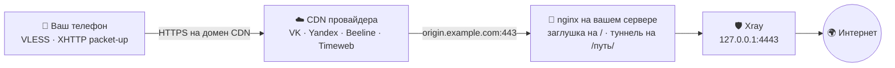

<div align="center">

# CDN-Installer

**VPN, который снаружи выглядит как обычный сайт.**

Одна команда в консоли сервера — дальше мастер спросит и всё поставит сам.

</div>

---

## Что это

Скрипт поднимает на вашем сервере VPN (VLESS на движке Xray) и прячет его за
российский CDN — ту самую сеть, через которую грузятся видео ВКонтакте и плитки
Яндекс.Карт.

Ваш телефон открывает HTTPS к адресу вроде `cdn12.gslb.vkcdn.ru` — ровно к
такому же, как когда вы листаете ленту ВК. Провайдер видит обычный CDN.
Заблокировать эти адреса нельзя: на них висят банки, госуслуги и стриминги.

| Слово | Простыми словами |
|---|---|
| **Нода** | сам VPN — то, что гоняет ваш трафик |
| **Панель** | админка: пользователи, статистика, управление нодами |
| **Origin** | ваш сервер, откуда CDN берёт данные — `origin.вашдомен` |
| **XHTTP packet-up** | режим Xray, где трафик нарезан на обычные HTTP-запросы: иначе через CDN он не пролезет |

---

## Установка

Понадобится: VPS с **Ubuntu 22.04/24.04 или Debian** под `root` (для Remnawave —
от 5 ГБ диска), домен с доступом к DNS и аккаунт у CDN-провайдера.

**1. Две A-записи на IP сервера, без проксирования** (в Cloudflare — серое облачко):

```
A     origin.example.com  →  <IP сервера>    для CDN
A     example.com         →  <IP сервера>    для панели и её сертификата
```

Домен панели направлять на CDN нельзя — Let's Encrypt проверяет его прямо на
сервере. Технический домен от провайдера в свой DNS заводить не нужно.

**2. Одна команда:**

```bash
curl -fsSL https://raw.githubusercontent.com/CraftStick/node-installer-cdn/main/node-installer-cdn.py -o node-installer-cdn.py && sudo python3 node-installer-cdn.py
```

**3. Ответы на вопросы** — режим, панель, CDN, домен, запасной вход. Все
спрашиваются в начале, дальше скрипт минут десять работает сам.

**4. Создание CDN-ресурса** — единственный ручной шаг: у провайдеров нет для
этого API. Скрипт напечатает инструкцию под вашего провайдера, с точными
галочками. Сделали — вернулись в консоль и ввели выданный домен.

В конце появится карточка с итогами: адрес панели, логин с паролем, ссылка на
подписку и готовая `vless://`-ссылка.

> [!IMPORTANT]
> Скрипт меняет сеть и системные службы. Обкатывайте на одноразовом VPS,
> лучше со снапшотом, сделанным до старта.

Оборвалось — просто запустите заново, скрипт продолжит с того же места. Начать
с нуля: `--fresh`. Без вопросов: `--mode 1 --panel 1 --cdn 1 --domain example.com`.

---

## Как это устроено



CDN ничего не кеширует, а сразу передаёт запросы на ваш origin. Кто зайдёт на
`origin.example.com` браузером — увидит обычную заглушку; угадает путь туннеля —
получит `404`.

---

## CDN-провайдеры

| `--cdn` | Провайдер | Скорость | Регистрация | Технический домен |
|:-:|---|---|:-:|---|
| `1` | VK Cloud | 100+ Мбит/с | по заявке | `*.gslb.vkcdn.ru` |
| `2` | Yandex Cloud | 100+ Мбит/с | открытая | `*.topology.gslb.yccdn.ru` |
| `3` | Beeline (CDNvideo) | 50–80 Мбит/с | по заявке | `*.a.trbcdn.net` |
| `4` | Timeweb | 50–80 Мбит/с | открытая | `*.cdn.twcstorage.ru` |

У всех есть бесплатный тариф. Проще начать с **Yandex Cloud** — регистрация
открыта, до сервера CDN ходит по HTTPS. **VK** быстрее, если аккаунт уже есть.
У Timeweb бывают провалы скорости.

---

## Четыре сценария

| № | Что ставим | Когда выбирать |
|:-:|---|---|
| **1** | Панель + нода + CDN на одной машине | первый запуск, один сервер |
| **2** | Панель здесь, нода на другом сервере по SSH | разнести управление и выход |
| **3** | Нода + CDN здесь, регистрация в готовой панели | добавить новую локацию |
| **4** | Только CDN перед работающей нодой | нода есть, не хватает маскировки |

Панель на выбор есть только в режиме 1: **Remnawave 3.x** (Docker, полный API —
установщик сам заводит профиль, ноду, хост, сквад и пользователя) или
**3x-ui** (проще и легче, обычная служба systemd, всё правится в вебе). В
остальных режимах — Remnawave: у 3x-ui Xray встроен в панель, отдельной ноды
не бывает.

---

## Что скрипт берёт на себя

Docker, панель с базой, Xray, nginx, сертификаты Let's Encrypt, профиль CDN и
хост в панели, подписки, страницу-заглушку. Плюс система: ufw с политикой
«всё запрещено» (открыты только SSH, 80, 443 и порты включённых входов), BBR,
swap, лимиты на файлы. Панель и база слушают только `127.0.0.1`, файлы с
секретами — права `600`, порт ноды 2222 пускает только IP панели.

Основной вход — **XHTTP packet-up** через CDN, ставится всегда. К нему
предлагается запасной **gRPC Reality** — прямой, на случай отказа CDN
(Remnawave: TCP `2053`, 3x-ui: случайный порт).

---

## Флаги

<details>
<summary><b>Показать полный список</b></summary>

```
--mode            1..4 — сценарий (см. таблицу выше)
--panel           1 = Remnawave 3.x, 2 = 3x-ui   (только режим 1)
--cdn             1 = VK, 2 = Yandex, 3 = Beeline, 4 = Timeweb
--domain          домен без http://
--front           nginx (по умолчанию) или caddy — чем поднимать фронт.
                  Caddy сам выпускает и продлевает сертификаты. Только флагом,
                  в мастере такого вопроса нет

# режим 2 — нода на другом сервере
--node-ip         IP удалённой ноды
--node-user       SSH-пользователь (по умолчанию root)
--node-pass       пароль
--node-key        путь к приватному SSH-ключу

# режим 3 — к существующей панели
--panel-url       IP/URL панели
--panel-ssh-user  SSH-пользователь панели (по умолчанию root)
--panel-ssh-pass  SSH-пароль панели
--panel-token     API-токен Remnawave. Не задан — скрипт возьмёт
                  /opt/remnawave/.panel_token с самой панели (есть, только если
                  панель ставил этот же установщик), иначе войдёт по
                  --panel-user / --panel-pass
--panel-user      логин админа панели
--panel-pass      пароль админа панели

# режим 4 — только CDN
--xport           порт, который уже слушает Xray на 127.0.0.1 (обычно 4443)
--path            существующий путь туннеля (например /abc123)

# повторная установка
--wipe            снести прошлую установку без вопросов (для автозапуска)
--no-wipe         не трогать прошлую установку, ставить поверх
--fresh           забыть сохранённый прогресс и начать с нуля

# прочее
--no-grpc         не добавлять запасной gRPC Reality
--no-origin-le    не выпускать Let's Encrypt для origin
--skip-dns-wait   не ждать, пока применится DNS
--skip-cdn-wait   не ждать настройки CDN у провайдера
```

</details>

---

## Если что-то пошло не так

| Симптом | Что смотреть |
|---|---|
| Не выпускается сертификат | домен должен вести прямо на сервер, **без** проксирования Cloudflare |
| Соединение не поднимается | в CDN-ресурсе должны быть выключены кеширование и сжатие, а параметры запроса — **не** игнорироваться: `sessionID` и `seq` едут именно в них |
| CDN отвечает, VPN молчит | откройте `https://origin.вашдомен`: заглушка есть — фронт жив, дело в настройках CDN-ресурса |
| Начать с нуля | `sudo python3 node-installer-cdn.py --fresh --wipe` |

В конце установки скрипт сам проверяет порты, фронт, сертификат и `404` на пути
туннеля. Что не сошлось — помечает значком ▲.

---

## Из чего собрано

Remnawave `backend:3` · Xray-core `26.7.28` · 3x-ui `v3.6.0` · PostgreSQL `18.4`
· Valkey `9-alpine`. Поверх: Docker с compose, nginx (или Caddy), certbot,
ufw/iptables. С чужими серверами скрипт общается по SSH.

Весь установщик — один файл `node-installer-cdn.py`. Тесты гоняются без сервера
и без root: `python3 -m unittest discover -v`.

---

> [!WARNING]
> **Дисклеймер.** Скрипт работает под `root`: ставит Docker, скачивает и
> запускает сторонние скрипты (`get.docker.com`, `3x-ui`, `Xray-install`),
> правит `iptables`/`ufw`, выпускает сертификаты. Запускайте только на своих
> серверах. Ответственность — на том, кто запускает.

## Лицензия

[MIT](LICENSE) — копируйте, меняйте, встраивайте куда угодно, в том числе в
коммерческие проекты. Условие одно: сохранить текст лицензии и указание
авторства.


<div align="center">

---

Если было полезно — поставь ⭐, это очень помогает!

If you found this useful, consider leaving a ⭐ — it helps a lot!

</div>
