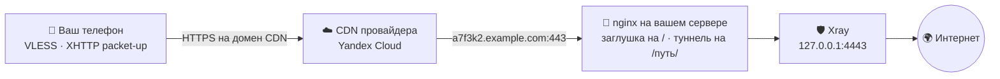

<div align="center">

# CDN-Installer

**VPN, который снаружи выглядит как обычный сайт.**

Одна команда в консоли сервера — дальше мастер спросит и всё поставит сам.

</div>

---

## Что это

Скрипт поднимает на вашем сервере VPN (VLESS на движке Xray) и прячет его за
российский CDN — сеть, через которую грузятся видео, карты и картинки крупных
сайтов.

Телефон открывает HTTPS к адресу вроде `cdn12.gslb.example.ru` — такому же, к
какому он обращается, когда вы листаете ленту соцсети. Со стороны это обычный
запрос к CDN. Заблокировать такие адреса целиком трудно: на них живут сайты,
которыми пользуются все.

| Слово | Что означает |
|---|---|
| **Нода** | сам VPN — то, что гоняет ваш трафик |
| **Панель** | админка: пользователи, статистика, управление нодами |
| **Origin** | ваш сервер, откуда CDN берёт данные |
| **XHTTP packet-up** | режим Xray, в котором трафик нарезан на обычные HTTP-запросы: иначе через CDN он не пройдёт |

Что получится в итоге: панель управления на вашем домене, один пользователь с
готовой подпиской и `vless://`-ссылкой, и туннель, который для сети снаружи
выглядит как обращение к CDN.

---

## Что понадобится

- VPS с **Ubuntu 22.04 / 24.04 или Debian**, доступ под `root`
- от 5 ГБ свободного диска (место занимает панель Remnawave)
- домен и доступ к его DNS
- аккаунт в **Yandex Cloud** — там создаётся CDN-ресурс

> [!IMPORTANT]
> Ставьте на чистый сервер. Скрипт меняет системные настройки: переписывает
> конфигурацию nginx, устанавливает Docker, включает файрвол ufw с политикой
> «запрещено всё, кроме разрешённого». На сервере, где уже работают другие
> сервисы, он их заденет. Возьмите свежий VPS или сделайте снапшот до запуска.

---

## Установка

### 1. Заведите DNS-записи

A-записи на IP сервера, **без проксирования** (в Cloudflare — серое облачко):

```
A     a7f3k2.example.com  →  <IP сервера>    источник для CDN
A     k9x2mt.example.com  →  <IP сервера>    панель и её сертификат
```

Оба поддомена скрипт придумывает сам и показывает на шаге DNS — заводите
именно те имена, что он напечатал.

Имена случайные не для красоты. Предсказуемое `origin.example.com` первым
попадает в словари, которыми ищут настоящий IP сервера за CDN. А панель на
корне домена стояла бы по угадываемому адресу, и её сертификат выпускался бы
на одно и то же имя при каждой переустановке — упираясь в недельный лимит
Let's Encrypt (5 штук на один набор имён).

Свои имена можно задать флагами `--origin-domain` и `--panel-domain`.

Домен панели на CDN направлять нельзя: Let's Encrypt проверяет его прямо на
сервере.

<details>
<summary>Насколько случайный поддомен скрывает сервер</summary>

От перебора по словарю — скрывает. От поиска по CT-логам — нет: сертификат
Let's Encrypt для этого имени публикуется, и имя видно через crt.sh. Если это
важно, запускайте с `--no-origin-le` — источник останется на самоподписанном
сертификате, а у CDN-провайдера нужно будет выключить проверку сертификата
источника.

</details>

### 2. Запустите установщик

```bash
curl -fsSL https://raw.githubusercontent.com/CraftStick/node-installer-cdn/main/node-installer-cdn.py -o node-installer-cdn.py && sudo python3 node-installer-cdn.py
```

### 3. Ответьте на вопросы

Режим, CDN-провайдер, домен, нужен ли запасной вход. Все вопросы задаются в
начале — дальше скрипт работает сам, это примерно десять минут.

### 4. Создайте CDN-ресурс

Единственный ручной шаг: API для создания ресурса провайдеры не дают. Скрипт
остановится и напечатает инструкцию под вашего провайдера — с уже
подставленными доменами и IP, их остаётся скопировать в консоль провайдера.
Подробный разбор с картой полей — ниже: [Yandex Cloud CDN](#yandex-cloud-cdn).

Когда ресурс создан, вернитесь в консоль и введите выданный провайдером
технический домен, а следом — свой домен для клиентов, если он нужен.

### 5. Заберите результат

Скрипт покажет DNS-записи, которые нужно завести (A на источник и CNAME своего
домена), и карточку с итогами: адрес панели, логин и пароль, ссылку на подписку
и готовую `vless://`-ссылку.

Подписку можно сразу открывать в клиенте (Hiddify, v2rayNG, Streisand и
подобных) — все параметры транспорта уже внутри.

---

## Как это устроено



CDN ничего не кеширует и сразу передаёт запросы на ваш сервер. Кто зайдёт на
источник браузером — увидит обычную страницу-заглушку. Кто угадает путь
туннеля — получит `404`: проксируется только то, что лежит под путём, а сам
путь отдаёт ошибку, как несуществующая страница.

---

## Yandex Cloud CDN

Сначала о доменах — их два, и путать их нельзя:

| Домен | Кто им пользуется | Пример |
|---|---|---|
| **источник (origin)** | по нему CDN ходит за данными на ваш сервер | `a7f3k2.example.com` |
| **клиентский** | его видят клиенты, он же домен CDN-ресурса | `cdn.example.com` |

### Шаг 1. Сертификат

**Certificate Manager → Создать сертификат → от Let's Encrypt**

- Домены: клиентский домен
- Тип проверки: **DNS**

Yandex покажет запись для проверки. Заводите её так — поля здесь путают чаще
всего:

| Поле | Значение |
|---|---|
| Type | `CNAME` |
| Name | `_acme-challenge.cdn.example.com` (в Cloudflare зону дописывать не надо) |
| Target | значение со страницы сертификата, оканчивается на `.cm.yandexcloud.net` |
| Proxy | DNS only, серое облачко |

В Target идёт значение от Yandex, а **не ваш домен**: иначе запись ведёт сама на
себя и проверка не пройдёт. Копируйте его кнопкой — строка длинная и
бессмысленная. Проверить:

```bash
dig +short _acme-challenge.cdn.example.com @1.1.1.1
```

Должен вернуться домен `.cm.yandexcloud.net`. Дальше ждите статуса **Issued** —
это от 5 до 30 минут.

> [!WARNING]
> После выпуска эту запись удалять нельзя. Yandex продлевает сертификат
> автоматически и каждый раз проверяет домен по ней. Без записи через 90 дней
> клиенты получат ошибку TLS.

### Шаг 2. Группа источников

**Cloud CDN → Группы источников → Создать**

- Источник: домен вашего источника
- Приоритет: основной

Создайте группу отдельно, до ресурса. Если создавать ресурс копированием
конфигурации другого ресурса, в него подтянется чужая группа источников — и CDN
пойдёт за данными не на ваш сервер. Смена SNI и заголовка Host это не лечит,
ответом будет `502`.

### Шаг 3. Ресурс

**Cloud CDN → Создать ресурс**

| Поле | Значение |
|---|---|
| Запрос контента | из группы источников |
| Группа источников | созданная на шаге 2 |
| Протокол к источникам | HTTPS |
| Задать SNI вручную | включить |
| Имя SNI-хоста | домен источника |
| Заголовок Host | своё значение → домен источника |
| Доменное имя ресурса | клиентский домен |
| Тип сертификата | из Certificate Manager |
| Сертификат | выпущенный на шаге 1 |
| Переадресация клиентов | с HTTP на HTTPS |

Названия полей похожи: **«Доменное имя источника»** — это ваш сервер, а
**«Доменное имя ресурса»** — то, что увидят клиенты. Если поменять их местами,
CDN пойдёт сам к себе.

Дальше по вкладкам мастера:

- **Кеширование** — выключить кеш CDN и кеш браузера, снять сегментацию больших
  файлов, выключить сжатие Gzip/Brotli
- **Query-параметры** — не игнорировать: в них едут параметры сессии туннеля
- **HTTP-заголовки и методы** — оставить как есть
- **Дополнительно** — выгрузка логов и экранирование источников не нужны

В списке разрешённых методов у Yandex есть только GET, HEAD и OPTIONS — POST
отсутствует. Это нормально: установщик настраивает туннель на аплинк
GET-запросами.

### Шаг 4. DNS

На странице ресурса, в блоке **«Настройки DNS»**, будет значение вида
`c5d6df029464d4c0.topology.gslb.yccdn.ru`. Заведите:

| Поле | Значение |
|---|---|
| Type | `CNAME` |
| Name | `cdn.example.com` |
| Target | `xxxxxxxx.topology.gslb.yccdn.ru` |
| Proxy | DNS only, серое облачко |

Правило то же: слева ваше имя, справа чужое. Cloudflare показывает итог строкой
«`cdn.example.com` is an alias of `xxxxxxxx.topology.gslb.yccdn.ru`» — если
написано наоборот, поля перепутаны местами.

Ресурс раскатывается по узлам до 15 минут, и всё это время ответы скачут между
`000`, `502` и `200` — так и должно быть. Повторные сохранения только
перезапускают отсчёт: сохранили и ждите.

### Шаг 5. Ответы установщику

- **CDN домен** — техническое значение `…yccdn.ru`
- **Свой домен для клиентов** — ваш клиентский домен

---

## Как проверить, что всё работает

Цепочка «клиент → CDN → сервер» собрана, если через CDN приходит страница-заглушка:

```bash
curl -s -o /dev/null -w '%{http_code}\n' https://cdn.example.com/
```

Ожидаемый ответ — `200`.

Когда клиент подключился, в логе сервера видно сам туннель:

```bash
awk '/<путь туннеля>/ {print $6, $9, $10}' /var/log/nginx/access.log | tail
```

Нужны строки `GET … 200` с ненулевым размером ответа. Путь туннеля скрипт
печатает в итоговой карточке.

---

## Режимы установки

| № | Что ставим | Когда выбирать |
|:-:|---|---|
| **1** | панель + нода + CDN на одной машине | первый запуск, один сервер |
| **2** | нода + CDN здесь, регистрация в готовой панели | добавить новую локацию |
| **3** | только CDN перед работающей нодой | нода есть, не хватает маскировки |

Панель поддерживается одна — **Remnawave 3.x**, разворачивается через Docker
Compose. Скрипт настраивает в ней всё сам: backend с базой, ноду, домены и
сертификаты, профиль с CDN-инбаундом, хост, сквад, пользователя и подписку.

**Режим 2** ничего в существующей панели не ломает: создаёт профиль,
регистрирует эту машину как ноду, заводит хост и пользователя, а свои инбаунды
дописывает в `Default-Squad`, не трогая чужие. Работает через API панели —
нужен SSH-доступ к её серверу, потому что API-вызовы идут изнутри. API-токен
можно передать флагом, иначе скрипт выпишет его сам.

---

## Что скрипт делает с сервером

Ставит и настраивает: Docker, панель с базой, Xray, nginx, сертификаты
Let's Encrypt, страницу-заглушку, профиль и хост в панели, подписки.

Меняет в системе: включает ufw по принципу «запрещено всё, кроме разрешённого»
(открыты только SSH, 80 и 443), включает BBR, добавляет swap,
поднимает лимиты на открытые файлы. В режиме 3 сервер уже работает, поэтому
включённый ufw остаётся как был (добавляются только 80/443), а при выключенном
открытыми остаются все порты, которые уже слушаются снаружи, — так порт ноды
`2222` и остальные её входы не закрываются.

Если Docker Hub недоступен, в `/etc/docker/daemon.json` дописываются зеркала.
Остальные настройки файла сохраняются, прежняя версия лежит рядом как
`daemon.json.bak.<время>`. Файл, который не читается как JSON, не трогается.

Что делается для безопасности: панель и база слушают только `127.0.0.1`, файлы
с секретами создаются с правами `600`, порт ноды `2222` принимает подключения
только с IP панели.

Вход у ноды один — **XHTTP packet-up** через CDN. Xray слушает только
`127.0.0.1`, наружу смотрит nginx, так что прямого пути к VPN в обход CDN нет.
Путь туннеля случайный, вида `/content/media/k3f9xa2b`.

### Повторная установка

Если установка оборвалась — просто запустите скрипт заново, он продолжит с того
же места.

Перед новой установкой скрипт находит остатки прошлой и предлагает их удалить:
каталоги `/opt/remnawave` и `/opt/remnanode`, контейнеры и тома Remnawave,
конфигурацию nginx и Caddy, docker-сети и правила ufw для порта ноды. Чужие
конфигурации он не трогает — только те, что писал сам.

Остаётся на сервере и после удаления: Docker с образами (пригодятся следующей
установке), сертификаты в `/etc/letsencrypt` (переиспользуются: у
Let's Encrypt есть недельные лимиты на повторный выпуск), системные настройки sysctl и лимиты,
остальные правила ufw. Ресурс у CDN-провайдера тоже остаётся: он создаётся
вручную и удаляется вручную.

Полезные флаги: `--fresh` — забыть сохранённый прогресс, `--wipe` — удалить
прошлую установку без вопросов, `--no-wipe` — поставить поверх, ничего не
удаляя.

> [!IMPORTANT]
> При запуске без терминала — из пайпа, скрипта или cron — прошлая установка
> **не удаляется**, даже если остатки найдены: спросить подтверждение не у
> кого, а снос уносит базу панели вместе с пользователями. Нужен снос в
> автозапуске — передавайте `--wipe` явно.

---

## Флаги

Установку можно пройти без единого вопроса:

```bash
sudo python3 node-installer-cdn.py --mode 1 --cdn yandex --domain example.com
```

<details>
<summary><b>Полный список флагов</b></summary>

```
--mode            1..3 — режим установки (см. таблицу выше)
--domain          домен без http://
--front           nginx (по умолчанию) или caddy — чем поднимать фронт.
                  Caddy сам выпускает и продлевает сертификаты. Задаётся
                  только флагом, в мастере такого вопроса нет

# режим 2 — к существующей панели
--panel-url       IP/URL панели
--panel-ssh-user  SSH-пользователь панели (по умолчанию root)
--panel-ssh-pass  SSH-пароль панели (лучше $CDN_PANEL_SSH_PASS, см. ниже)
--panel-key       путь к приватному SSH-ключу панели (прежнее имя --node-key
                  тоже принимается)
--panel-token     API-токен Remnawave. Не задан — скрипт возьмёт
                  /opt/remnawave/.panel_token с самой панели (файл есть, если
                  панель ставил этот же установщик), иначе войдёт по
                  --panel-user / --panel-pass
--panel-user      логин админа панели
--panel-pass      пароль админа панели (лучше $CDN_PANEL_PASS)

# режим 3 — только CDN
--xport           порт, который уже слушает Xray на 127.0.0.1 (обычно 4443)
--path            существующий путь туннеля (например /abc123)

# повторная установка
--wipe            удалить прошлую установку без вопросов. Без терминала
                  снос без этого флага не делается вовсе
--no-wipe         не трогать прошлую установку, ставить поверх
--fresh           забыть сохранённый прогресс и начать с нуля

--origin-domain   домен источника для CDN (иначе случайный поддомен)
--panel-domain    домен панели (иначе случайный поддомен)

# домены CDN (иначе скрипт спросит их в конце)
--cdn-domain      технический домен ресурса CDN
--client-domain   свой домен для клиентов, CNAME на технический

# прочее
--no-origin-le    не выпускать Let's Encrypt для источника
--skip-dns-wait   не ждать, пока применится DNS
--skip-cdn-wait   не ждать настройки CDN у провайдера
```

Пароли и токен, переданные флагами, видны всем пользователям сервера в `ps` и
остаются в истории shell. Поэтому скрипт берёт их и из окружения:
`CDN_PANEL_SSH_PASS`, `CDN_PANEL_PASS`, `CDN_PANEL_TOKEN`. Так значение не
попадает ни в команду, ни в историю:

```bash
read -rs CDN_PANEL_SSH_PASS && export CDN_PANEL_SSH_PASS && sudo --preserve-env=CDN_PANEL_SSH_PASS python3 node-installer-cdn.py --mode 2 --panel-url 1.2.3.4
```

</details>

---

## Если что-то пошло не так

| Симптом | Что проверить |
|---|---|
| Не выпускается сертификат | домен должен вести прямо на сервер, **без** проксирования Cloudflare |
| `Let's Encrypt: лимит исчерпан` | 5 сертификатов в неделю на один и тот же набор имён. Поставьте панель на другой поддомен: `--panel-domain panel2.example.com` |
| Соединение не поднимается | в CDN-ресурсе выключите кеширование и сжатие. Сессия туннеля едет в пути (`/путь/<uuid>/<номер>`), поэтому кеш отдаёт клиенту чужой ответ и связь рассыпается |
| Соединение есть, трафика нет | сначала обновите подписку в клиенте: после переустановки меняются путь туннеля и ссылка, а старый профиль выглядит подключённым и молчит. Если подписка свежая — нода могла не получить пользователей: `docker restart remnanode` |
| Соединение есть, трафика нет, ссылку собирали вручную | в `vless://` должны быть параметры транспорта (`extra=`). Берите ссылку из итоговой карточки или из подписки — собранная руками без них не работает |
| CDN отвечает, VPN молчит | откройте источник по HTTPS (его имя скрипт печатал на шаге DNS). Есть заглушка — сервер жив, дело в настройках CDN-ресурса |
| После переустановки поменялся домен источника | запускайте с `--origin-domain a7f3k2.example.com`, тогда ресурс CDN править не придётся |
| Начать с нуля | `sudo python3 node-installer-cdn.py --fresh --wipe` |

Отдельно про CDN: после изменения ресурса ответы 10–15 минут скачут между
`000`, `502` и `200`, пока настройки расходятся по узлам. И если CDN какое-то
время ходил на несуществующее имя, часть узлов помнит это ещё около десяти
минут после того, как всё исправлено.

В конце установки скрипт сам проверяет порты, фронт, сертификат и `404` на пути
туннеля. Что не сошлось — помечает значком ▲.

---

## Из чего собрано

Remnawave `backend:3` · Xray-core `26.7.28` · PostgreSQL `18.4` · Valkey
`9-alpine`. Поверх: Docker с compose, nginx (или Caddy), certbot, ufw/iptables.
С сервером панели в режиме 2 скрипт общается по SSH.

Весь установщик — один файл `node-installer-cdn.py` без внешних зависимостей.
Тесты запускаются без сервера и без root:

```bash
python3 -m unittest discover -v
```

---

> [!WARNING]
> **Дисклеймер.** Скрипт работает под `root`: ставит Docker, скачивает и
> запускает сторонние скрипты (`get.docker.com`, `Xray-install`), правит
> `iptables`/`ufw`, выпускает сертификаты. Запускайте только на своих серверах.
> Ответственность — на том, кто запускает.

## Лицензия

[MIT](LICENSE) — копируйте, меняйте, встраивайте куда угодно, в том числе в
коммерческие проекты. Условие одно: сохранить текст лицензии и указание
авторства.


<div align="center">

---

Если было полезно — поставьте ⭐, это очень помогает!

If you found this useful, consider leaving a ⭐ — it helps a lot!

</div>
