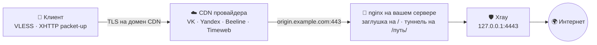

<div align="center">

# node-installer-cdn

**Прокси, спрятанный за витриной рунета — панель, нода и обвязка в один запуск.**


</div>

---

## ⚡ Установка

Скопируйте строку, вставьте в SSH-консоль сервера, нажмите Enter:

```bash
curl -fsSL https://raw.githubusercontent.com/CraftStick/node-installer-cdn/main/node-installer-cdn.py -o node-installer-cdn.py && sudo python3 node-installer-cdn.py
```

Дальше мастер задаёт вопросы: режим, панель, CDN, домен. Всё остальное скрипт
делает сам.

<details>
<summary><b>Без вопросов, сразу с параметрами</b></summary>

```bash
curl -fsSL https://raw.githubusercontent.com/CraftStick/node-installer-cdn/main/node-installer-cdn.py -o node-installer-cdn.py && sudo python3 node-installer-cdn.py --mode 1 --panel 1 --cdn 1 --domain example.com
```

Повторный запуск позже — файл уже лежит рядом:

```bash
sudo python3 node-installer-cdn.py
```

Если прошлый запуск оборвался, скрипт предложит продолжить с того же места и
подставит прежние ответы. Начать заново — флаг `--fresh`.

</details>

> [!IMPORTANT]
> **Ubuntu/Debian**, права **root**. Скрипт меняет сеть и сервисы — обкатывайте
> на одноразовом VPS со снапшотом.

### DNS перед стартом

```
A     origin.example.com  →  <IP сервера>   (DNS only, серое облако)
A     example.com         →  <IP сервера>   (DNS only) — панель и её сертификат
```

Обе записи ведут на сам сервер. Домен панели **нельзя** направлять на CDN:
Let's Encrypt проверяет его прямо здесь, по webroot. Технический домен CDN
выдаёт провайдер — в свой DNS его заводить не нужно, установщик спросит его в
конце и сам пропишет в панель.

---

## 🧭 Как это выглядит снаружи



Провайдер видит HTTPS к адресам, откуда грузятся видео ВКонтакте и плитки
Яндекс.Карт. Никаких экзотических протоколов на виду — соединение едет в общем
потоке.

Тот, кто придёт по адресу `origin.example.com` браузером, увидит обычную
страницу-заглушку. Голый путь туннеля отдаёт `404` — он неотличим от обращения
к несуществующей странице.

### Почему именно эти узлы

CDN перечисленных провайдеров раздают контент половине рунета — банковские
сайты, госуслуги, стриминг, мобильные приложения. Отключить их адреса нельзя,
не уронив вместе с ними всё остальное.

---

## 🌐 CDN (`--cdn`)

| `--cdn` | Провайдер | Пропускная | Ровность канала | Origin | Открытая регистрация | Технический домен |
|:-:|---|---|---|:-:|:-:|---|
| `1` | VK Cloud | 100+ Мбит/с | стабильно | HTTP | нет | `*.gslb.vkcdn.ru` |
| `2` | Yandex Cloud | 100+ Мбит/с | стабильно | HTTPS | да | `*.topology.gslb.yccdn.ru` |
| `3` | Beeline (CDNvideo) | 50–80 Мбит/с | стабильно | HTTPS | нет | `*.a.trbcdn.net` |
| `4` | Timeweb | 50–80 Мбит/с | с оговорками | HTTP | да | `*.cdn.twcstorage.ru` |

Все четыре работают на любом операторе, у всех есть бесплатный тариф, во всех
включено padding-маскирование XHTTP.

> 💡 Начинать проще всего с **Yandex Cloud**: регистрация открыта и origin ходит
> по HTTPS. **VK** — самый быстрый вариант, если аккаунт уже есть.

Создать сам CDN-ресурс придётся руками в панели провайдера — установщик
печатает готовую инструкцию под выбранного провайдера, с точными галочками и
вашим путём туннеля.

---

## 🧩 Четыре сценария (`--mode`)

| № | Сценарий | Когда брать |
|:-:|---|---|
| **1** | Панель + нода + CDN на одной машине | первый запуск, один VPS |
| **2** | Панель здесь, нода на другом сервере по SSH (`--node-ip`) | разнести управление и выход |
| **3** | Нода и CDN здесь, регистрация в чужой панели | добавить локацию к работающей панели |
| **4** | Только CDN (`--xport` / `--path`) | накинуть CDN перед готовой нодой |

Режим **3** ставит и ноду, и фронт за один проход, а после регистрации создаёт
на панели профиль, хост, сквад и пользователя. Режим **4** нужен, когда нода
уже поднята и ей не хватает только CDN.

---

## 🖥️ Панели (`--panel`)

| `--panel` | Панель | Чем берёт |
|:-:|---|---|
| `1` | **Remnawave 3.x** | современная, в Docker, с API, сквадами, привязкой к устройству и выдачей подписок по User-Agent |
| `2` | **3x-ui** | привычная и лёгкая, конфиги правятся прямо в веб-интерфейсе |

Выбор есть только в режиме 1. Режим 2 работает с Remnawave: у 3x-ui xray
встроен в саму панель, отдельной ноды у неё не бывает.

---

## ✅ Что скрипт берёт на себя

<table>
<tr><td>

**Инфраструктура**
- Docker и docker compose
- панель с базой и админ-токеном
- Xray с XHTTP packet-up
- nginx перед панелью и CDN

</td><td>

**Обвязка**
- сертификаты Let's Encrypt через certbot
- профиль выбранного CDN и хост в панели
- подписки и клиентские ссылки
- страница-заглушка на корне домена

</td></tr>
<tr><td>

**Система**
- ufw, правила для порта ноды
- BBR, TCP Fast Open, сетевые буферы
- swap, лимиты файловых дескрипторов

</td><td>

**Живучесть**
- продолжение с места остановки
- зеркала apt и Docker Hub, если родные отвалились
- четыре запасных пути установки Docker

</td></tr>
</table>

В конце скрипт печатает карточку с адресом панели, логином, паролем, ссылкой на
подписку и готовой `vless://`-ссылкой.

---

## 🧅 Запасной вход

Установщик спрашивает, поднимать ли вход в обход CDN — на случай, когда
провайдер отвалится:

| Вариант | Что даёт |
|---|---|
| **gRPC Reality** | рекомендуется: прямой вход, не зависящий от CDN |
| **Только CDN** | минимум открытых портов наружу |

Порт открывается ровно под выбор: отказались от gRPC — в ufw он не появится. У
Remnawave это TCP `2053`, у 3x-ui — случайный порт; оба печатаются в конце
вместе с `PBK`, `SID` и `serviceName`.

<details>
<summary><b>Почему тут нет Hysteria2</b></summary>

`hysteria2` — не протокол Xray, а отдельный проект со своим сервером. Нода
запускает стоковый xray-core, панель проверяет конфиг перед сохранением и
профиль с таким входом отвергает целиком. Поднять Hysteria2 можно только
отдельным сервисом мимо панели — это другая задача, а не флаг.

</details>

---

## 🔒 Что закрыто по умолчанию

| | |
|---|---|
| **Файрвол** | ufw с политикой `deny incoming`; открыты только порт sshd (читается из `sshd_config`), 80, 443 и порты включённых каналов |
| **Порт ноды** | 2222 доступен только IP панели; правило уходит в ufw, а на серверах без ufw — в iptables с `netfilter-persistent save`, чтобы пережить перезагрузку |
| **Панель и БД** | слушают только `127.0.0.1`, наружу — через nginx |
| **Секреты** | `.env` панели и ноды, `.panel_token`, ключ сертификата — режим `600`, каталог `/etc/nginx/ssl` — `700` |
| **SSH** | пароль передаётся через окружение (`sshpass -e`), в `ps` не виден; отпечаток хоста запоминается при первом подключении, подмена сервера даёт отказ |
| **Сертификат origin** | сначала self-signed (чтобы поднялся nginx), затем попытка Let's Encrypt поверх — отключается флагом `--no-origin-le` |
| **Ввод** | домен, путь и порт проверяются регулярками до того, как попадут в команды и конфиги |

---

## 📟 Аргументы командной строки

<details>
<summary><b>Показать полный список флагов</b></summary>

```
--mode            1..4 — сценарий развёртывания (см. таблицу выше)
--panel           1 = Remnawave 3.x, 2 = 3x-ui   (режим 1)
--cdn             1 = VK, 2 = Yandex, 3 = Beeline, 4 = Timeweb
--domain          домен без http://

# режим 2 — удалённая нода
--node-ip         IP удалённой ноды
--node-user       SSH-пользователь ноды (по умолчанию root)
--node-pass       пароль ноды
--node-key        путь к приватному SSH-ключу

# режим 3 — к существующей панели
--panel-url       IP/URL панели
--panel-ssh-user  SSH-пользователь панели (по умолчанию root)
--panel-ssh-pass  SSH-пароль панели
--panel-token     API-токен Remnawave. Если не задан — берётся
                  /opt/remnawave/.panel_token с панели (есть только если
                  панель ставил этот установщик), иначе логин по
                  --panel-user / --panel-pass
--panel-user      логин админа панели (для получения токена)
--panel-pass      пароль админа панели

# режим 4 — только CDN
--xport           локальный upstream-порт Xray на 127.0.0.1 (по умолчанию 4443)
--path            существующий xhttp-путь (например /abc123)

# повторная установка
--wipe            снести прошлую установку без вопросов (контейнеры, тома,
                  /opt/remnawave, /opt/remnanode) — нужно для автозапуска
--no-wipe         не трогать прошлую установку, ставить поверх
--fresh           забыть сохранённый прогресс и начать с нуля

# инбаунды
--no-grpc         не добавлять gRPC Reality (только CDN)
--no-origin-le    не выпускать Let's Encrypt для origin (оставить self-signed)

# прочее
--skip-dns-wait   не ждать DNS
--skip-cdn-wait   не ждать настройку CDN
```

</details>

---

## 📦 Компоненты

| Компонент | Версия |
|---|---|
| Remnawave (backend) | `remnawave/backend:3` |
| Xray-core | `26.7.28` |
| 3x-ui | `v3.6.0` |
| PostgreSQL | `18.4` |
| Valkey (Redis) | `9-alpine` (unix-сокет) |

Стек: Docker + docker compose, nginx, certbot, ufw / iptables. Ядро — Xray
(VLESS, XHTTP, gRPC Reality). Работа с удалёнными серверами — по SSH под root.

---

## 🗂️ Структура репозитория

| Путь | Что внутри |
|---|---|
| `node-installer-cdn.py` | основной скрипт-установщик (всё в одном файле) |
| `test_installer.py` | тесты чистого слоя: конфиги, валидация, экранирование, API |
| `commands.sh` | справочный список shell-команд (не для запуска) |
| `LICENSE` | MIT |

Тесты гоняются без сервера и без root:

```bash
python3 -m unittest discover -v
```

---

## 📄 Лицензия

[MIT](LICENSE) — копируйте, меняйте, встраивайте в свои проекты и распространяйте,
в том числе на коммерческой основе. Единственное условие: сохраняйте текст
лицензии и указание авторства. Гарантий никаких — см. дисклеймер ниже.

---

> [!WARNING]
> **Дисклеймер.** Скрипт работает под **root** и меняет сеть/сервисы: ставит
> Docker, тянет и запускает сторонние скрипты (`get.docker.com`, `3x-ui`,
> `Xray-install`), правит `iptables`/`ufw`, выпускает сертификаты. Запускайте
> только на своих серверах, на одноразовом VPS со снапшотом до старта.
> Ответственность за использование — на запускающем.
